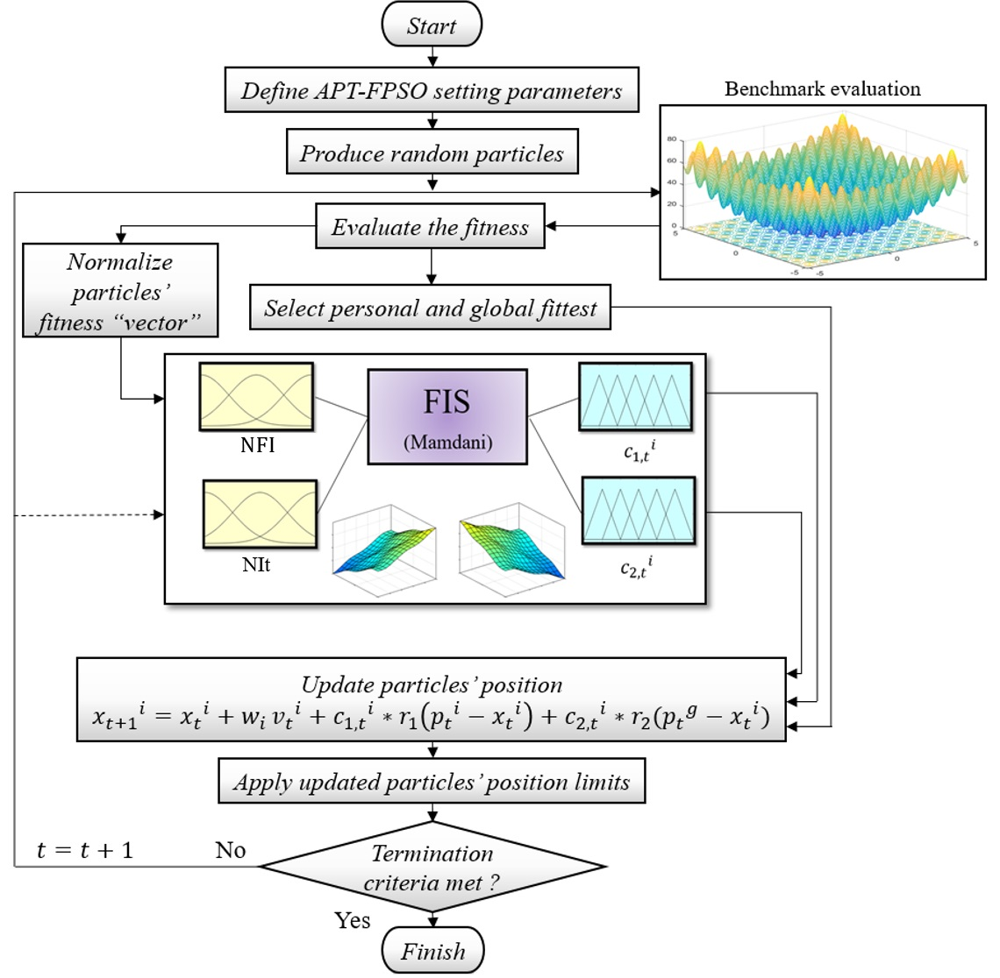

# Adaptive-Particularly-Tunable-Fuzzy-PSO-(APT-FPSO)-algorithm
MATLAB code for the Adaptive Particularly Tunable Fuzzy PSO (APT-FPSO) algorithm, featuring adaptive fuzzy logic for dynamic parameter tuning to enhance optimization performance.

<!-- Use HTML to center and resize the image -->

  

## Overview
This repository features the Adaptive Particularly Tunable Fuzzy Particle Swarm Optimization (APT-FPSO) algorithm, an advanced variant of the standard Particle Swarm Optimization (PSO). Utilizing fuzzy logic, APT-FPSO adaptively tunes the learning coefficients for each particle at every iteration, enhancing the algorithm's balance between exploration and exploitation. The repository focuses on a single benchmark function, Griewangk, and demonstrates APT-FPSO’s effectiveness through detailed statistical analysis. This implementation is ideal for exploring the algorithm’s capabilities in complex optimization scenarios that require robust performance. For more detailed informat
